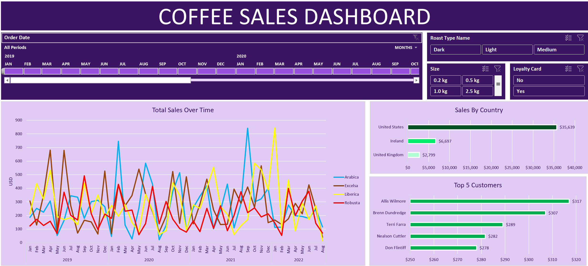
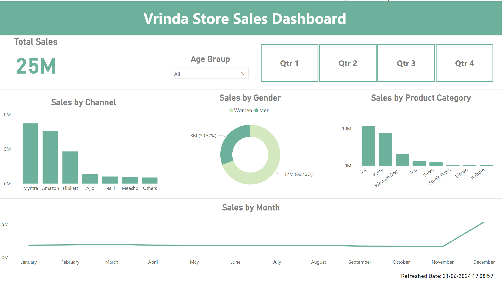

# DATA ANALYTICS PORTFOLIO
# Project 1
**Title:** [COFFEE SALES PERFORMANCE DASHBOARD](https://github.com/chyrose/chyrose.github.io/blob/main/coffeeOrdersProject.xlsx)

**Tools:** Microsoft Excel (Pivot Table, Conditional Formatting, Pivot Chart, Power Query Editor)

**Description:** This project involved analyzing sales data of a coffee shop to identify trends and patterns in sales performance in 2021...

**Key Findings:**

**Dashboard Overview:** 

# Project 2
**Title:** [Vrinda Store SALES PERFORMANCE DASHBOARD](https://github.com/chyrose/chyrose.github.io/blob/main/Vrinda%20Store%20Sales%20Dashboard.pbix)

**Tools:** Power Bi (DAX, Power Query Editor), SQL (DDL, DML, DXL)

**Description:** This project involved analyzing sales data of Vrindashop to identify trends and patterns in sales performance in 2021...

**Key Findings:**

**Dashboard Overview:** 

# Project 3
**Title:** Customer Data Cleansing

**SQL Code:**  [Customer data SQL queries](https://github.com/chyrose/chyrose.github.io/blob/main/Customerdata.sql) 

**Description:** Update this...

**Skills:**  SQL (DDL, DML, DXL)

