## Denim Product Line Sales Report SQL Queries

**-- Consolidated Data in a View Table**
```
CREATE VIEW [Denim Line Product Data] AS
SELECT
    o.[order_id] as [Order ID], 
	o.order_date [Order Date],
	o.customer_id as [Customer ID],
	o.product_id as [Product ID],
	o.quantity as Quantity,
    c.Customer_name as [Customer Name], 
    c.Country, 
    c.city as City, 
    c.Loyalty_Card as [Loyalty Card Status], 
    p.product_name as [Product Name], 
    p.category as [Product Category], 
    p.colour as Colour, 
    p.unit_price as [Unit Price], 
    p.unit_cost [Unit Cost],
	cast(o.quantity*p.unit_price as decimal (10,2)) as Sales,
	cast((p.unit_price-p.unit_cost)*o.quantity as decimal(10,2)) as Profit
FROM 
    [dbo].[Orders] AS o
LEFT JOIN 
    [dbo].[customers] AS c ON o.customer_id = c.customer_id 
LEFT JOIN 
    [dbo].[products] AS p ON o.product_id = p.product_id;
```

<br />

**Output**


#### Total sales
```
Select Format(Sum([Sales]), 'c', 'en-GB') as [Total Sales]
From [dbo].[Denim Line Product Data]
```

**Output**

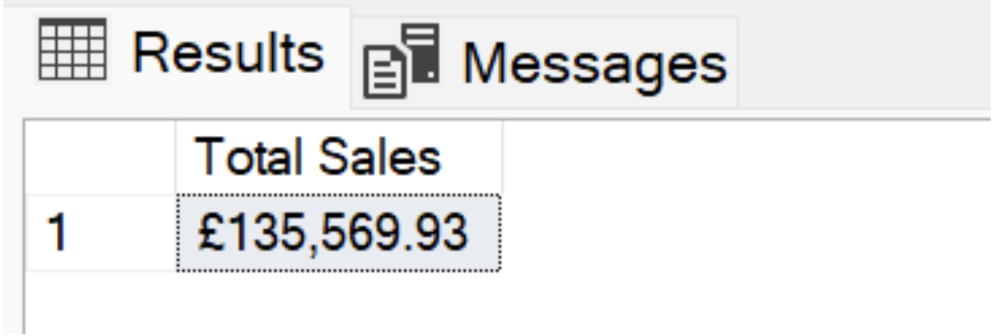

<br />

#### -- Sales YoY % Change

```
WITH YearlySales as (
    SELECT 
        YEAR([Order Date]) AS Year,
        SUM([Sales]) AS TotalSales
    FROM [dbo].[Denim Line Product Data]
    GROUP BY YEAR([Order Date])
)

SELECT 
    ys.Year,
    FORMAT(ys.TotalSales, 'c', 'en-GB') AS [Total Sales],
    --FORMAT(ys.TotalSales - COALESCE(LAG(ys.TotalSales) OVER (ORDER BY ys.Year), 0), 'c', 'en-GB') AS [YoY Change],
    CASE 
        WHEN LAG(ys.TotalSales) OVER (ORDER BY ys.Year) IS NULL THEN NULL
        ELSE ((ys.TotalSales - LAG(ys.TotalSales) OVER (ORDER BY ys.Year)) / LAG(ys.TotalSales) OVER (ORDER BY ys.Year) * 100) 
    END AS [YoY % Change]
FROM 
    YearlySales as ys
ORDER BY 
    ys.Year
```

**Output**

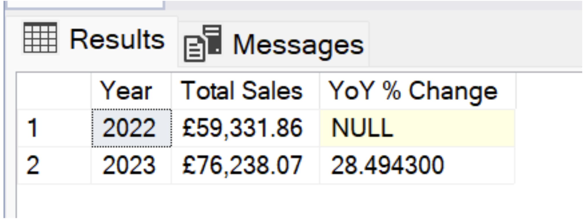

<br />

#### -- Sale by Loyalty Card

```
[Loyalty Card Status], 
    FORMAT(CAST(COUNT([Order ID]) AS DECIMAL(10, 2)) * 100.0 / SUM(COUNT([Order ID])) OVER (), 'N2') + '%' AS [Percentage of Total Sales]
FROM 
    [dbo].[Denim Line Product Data]
GROUP BY 
    [Loyalty Card Status]
```

**Output**

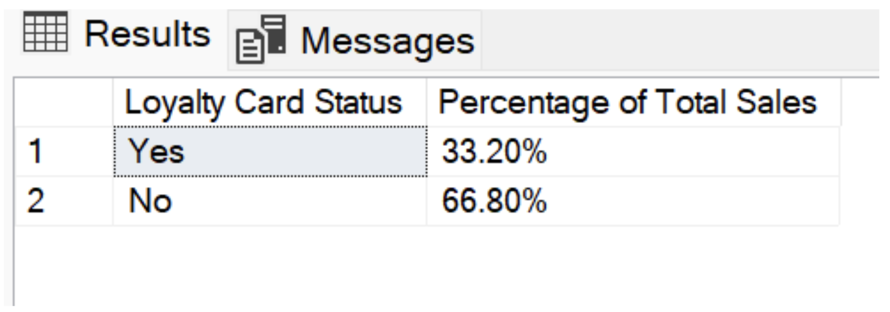

<br />

#### -- Total Monthly Sales by Product (Top 4)

```
WITH ProductSales AS (
    SELECT TOP(4)
        [Product Name],  
        SUM([Sales]) AS TotalSales
    FROM 
        [dbo].[Denim Line Product Data]
    GROUP BY 
        [Product Name]
    ORDER BY 
        TotalSales DESC
)

SELECT 
	DATENAME(MONTH, [Order Date]) AS [Month Name], 
    SUM(CASE WHEN [Product Name] = 'Denim Jacket Classic' THEN Sales ELSE 0 END) AS [Denim Jacket Classic],
    SUM(CASE WHEN [Product Name] = 'Denim Jacket Hooded' THEN Sales ELSE 0 END) AS [Denim Jacket Hooded],
    SUM(CASE WHEN [Product Name] = 'Denim Jacket Cropped' THEN Sales ELSE 0 END) AS [Denim Jacket Cropped],
    SUM(CASE WHEN [Product Name] = 'Denim Jeans Flare Cut' THEN Sales ELSE 0 END) AS [Denim Jeans Flare Cut]
FROM 
    [dbo].[Denim Line Product Data] 
WHERE 
    [Product Name] IN (SELECT [Product Name] FROM ProductSales)  
GROUP BY 
	DATENAME(MONTH, [Order Date]),
	MONTH([Order Date])
ORDER BY 
    MONTH([Order Date]) ASC
```

**Output**

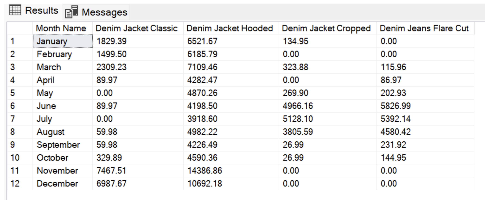

<br />

#### -- Total Profit

```
Select Format(Sum([Profit]), 'c', 'en-GB') as [Total Profit]
From [dbo].[Denim Line Product Data]
```

**Output**

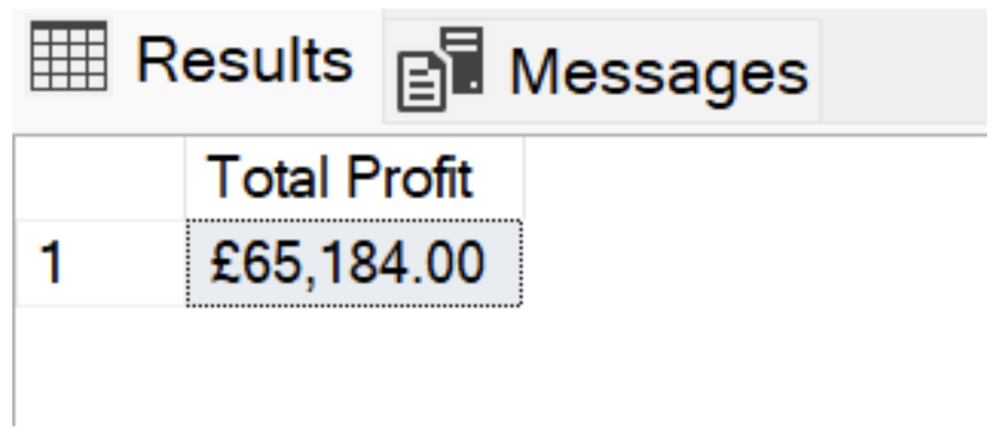

<br />

#### -- AOV (Average Order Value) 

```
Select Format(Sum([Sales])/Count([Order ID]), 'c', 'en-GB') as [Average Order Value]
From [dbo].[Denim Line Product Data]
```

**Output**

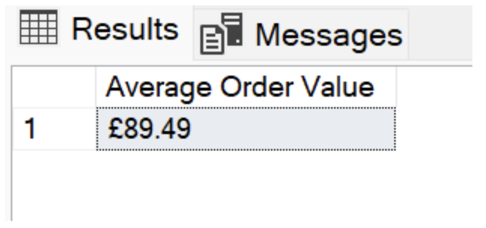

<br />

#### -- Total Number of Orders

```
Select FORMAT(Count([Order ID]), 'N0') as [Total Product Quantity]
From [dbo].[Denim Line Product Data]
```

**Output**

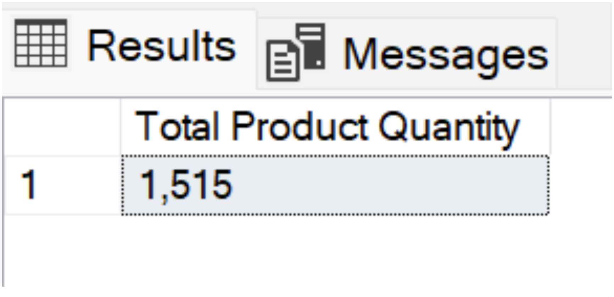

<br />

#### -- Total quantity of product ordered

```
Select FORMAT(Sum(quantity), 'N0') as [Total Product Quantity]
From [dbo].[Denim Line Product Data]
```

**Output**

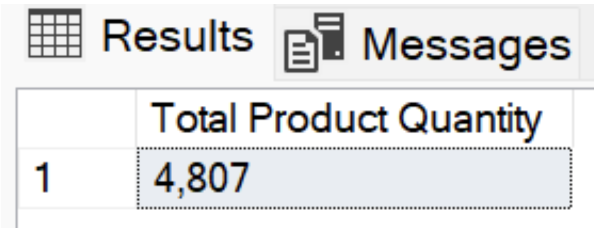


<br />

#### -- Total Number of Customers

```
Select Count(Distinct ([Customer ID])) as [Total Number of Customers]
From [dbo].[Denim Line Product Data]
```

**Output**

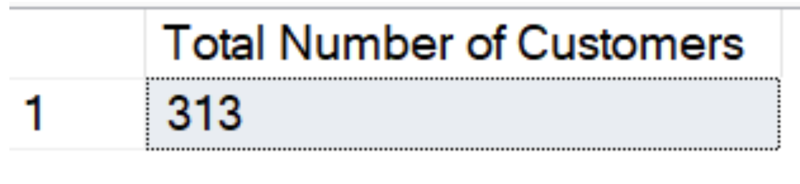


<br />

#### -- Number of Unique Customers

```
SELECT 
    COUNT(*) AS [Unique Customers]
FROM (
    SELECT 
        [Customer ID]
    FROM 
        [dbo].[Denim Line Product Data]
    GROUP BY 
        [Customer ID]
    HAVING 
        COUNT([Order ID]) = 1
) AS UniqueCustomerCount;
```

**Output**

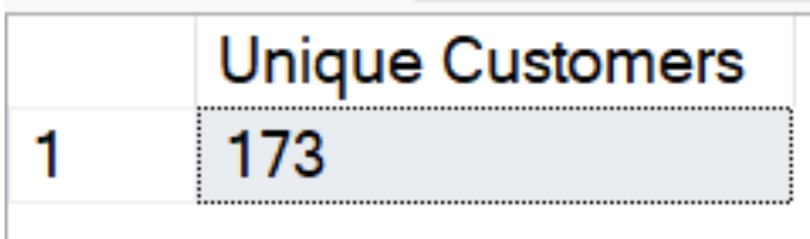

<br />

#### -- Top 3 Products by Profits

```
Select Top(3) [Product Name], FORMAT(Sum([Profit]), 'C', 'en-GB') AS [Total Profit]
From [dbo].[Denim Line Product Data]
Group by [Product Name]
Order by Sum([Profit]) desc
```

**Output**

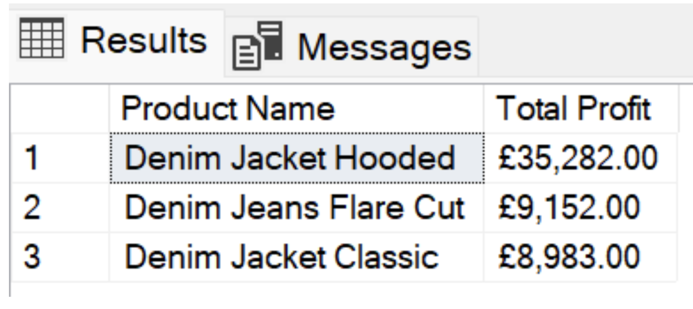


<br />

#### -- Bottom 3 Products by Profits

```
SELECT 
    p.[Product Name], 
     FORMAT(p.[Total Profit], 'C', 'en-GB') as [Total Profit]
FROM (
    SELECT TOP(3) 
        [Product Name], 
        SUM([Profit]) AS [Total Profit]
    FROM 
        [dbo].[Denim Line Product Data]
    GROUP BY 
        [Product Name]
    ORDER BY 
        SUM([Profit]) ASC 
) AS p
ORDER BY 
    p.[Total Profit] DESC;
```

**Output**

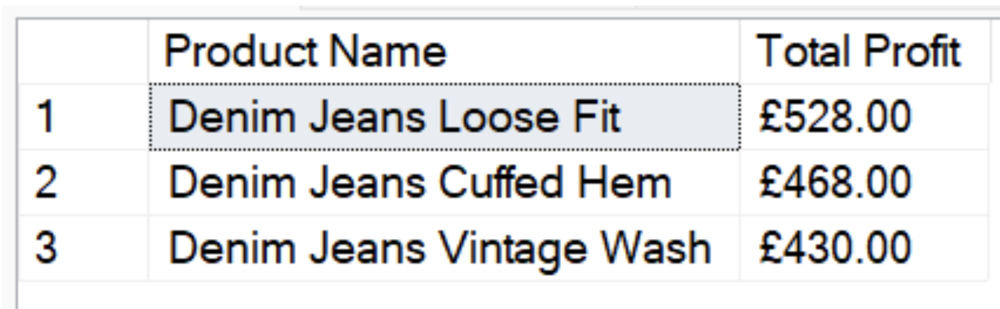


<br />

#### -- Product Sales by Year and Variance

```
SELECT
    [Product Name],
    FORMAT(SUM(CASE WHEN YEAR([Order Date]) = 2022 THEN Sales ELSE 0 END), 'C', 'en-GB') AS [2022], 
    FORMAT(SUM(CASE WHEN YEAR([Order Date]) = 2023 THEN Sales ELSE 0 END), 'C', 'en-GB') AS [2023],
    FORMAT(
        (SUM(CASE WHEN YEAR([Order Date]) = 2023 THEN Sales ELSE 0 END) -
         SUM(CASE WHEN YEAR([Order Date]) = 2022 THEN Sales ELSE 0 END)), 'C', 'en-GB'
    ) AS Variance 
FROM
    [dbo].[Denim Line Product Data]
GROUP BY
    [Product Name]
ORDER BY
    SUM(CASE WHEN YEAR([Order Date]) = 2022 THEN Sales ELSE 0 END) +
    SUM(CASE WHEN YEAR([Order Date]) = 2023 THEN Sales ELSE 0 END) DESC;
```

**Output**

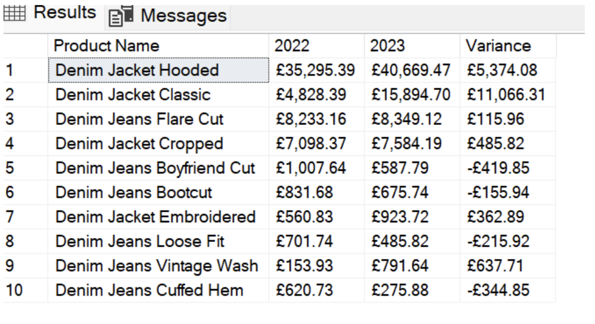